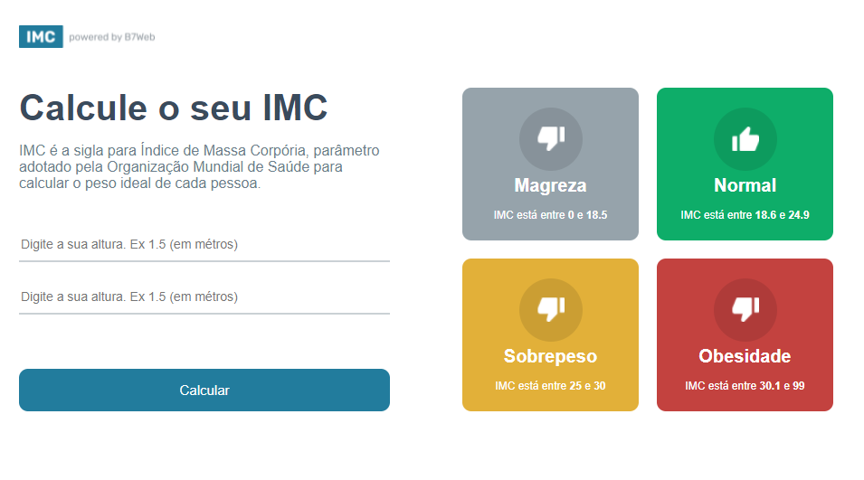
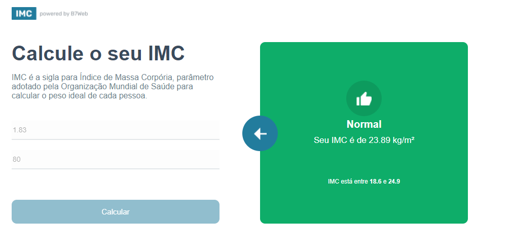

# Calculadora de IMC

Projeto em React + Typescript fazendo uma calculadora de IMC.

Projeto desenvolvido durante o curso [B7web](https://b7web.com.br/fullstack/)

🌐 Web: https://reactcalcimc.herokuapp.com/

## Screenshot

## Para Rodar

- `npm start`
